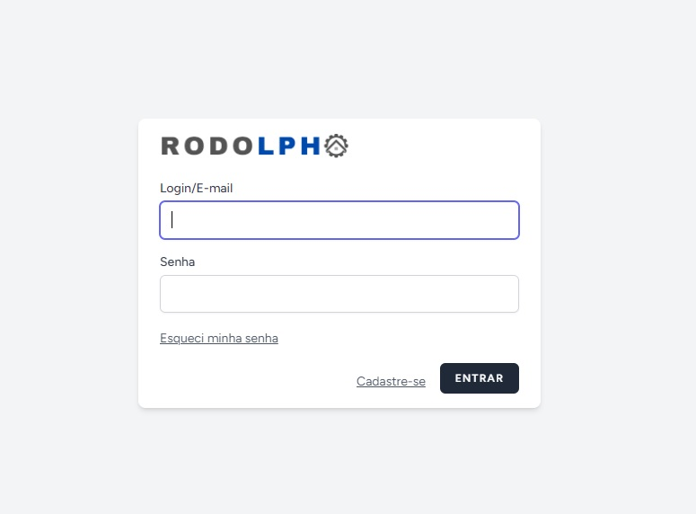

# Meu Projeto Laravel com Vite e Breezer

Bem-vindo ao meu projeto Laravel! Este projeto utiliza Laravel 10 com Vite, Breezer, Inertia e Vue 3 para criar uma aplicação web poderosa.

)

## Requisitos

- PHP >= 8.2.12
- Docker e Docker Compose
- Node.js >= 20.9.0
- NPM >= 10.2.3
- Composer

## Configuração Inicial

### Clonando o Repositório

Clone o repositório para sua máquina local:

## Docker Sail
Este projeto utiliza o Docker Sail para simplificar o ambiente de desenvolvimento. Você pode iniciar o ambiente Docker Sail com o seguinte comando:
./vendor/bin/sail up

## Instalação de Dependências
Depois de iniciar o ambiente Sail, você precisa instalar as dependências do PHP e do Node.js. Use os seguintes comandos:

- composer install
- npm install

## Configuração do Banco de Dados
Crie um arquivo .env com base no arquivo .env.example e configure suas credenciais de banco de dados.
- cp .env.example .env

Em seguida, gere uma chave de aplicativo:
- sail php artisan key:generate

E execute as migrações do banco de dados:
- sail php artisan migrate --seed

## Rodando o Projeto
Após a configuração inicial, você pode iniciar o servidor de desenvolvimento com o seguinte comando:
- sail npm run dev

acesse o aplicativo em seu navegador em http://localhost.

